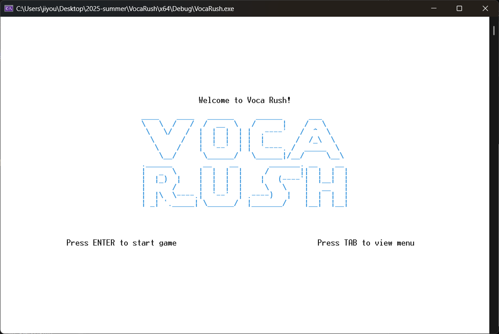

# CPP-VocaRush
Console-based 2-player word battle game built wit

# VocaRush: 콘솔 기반 단어 배틀 게임

## Ⅰ. 서론
### 1. 기획 배경 및 목적
- 기존의 단순한 콘솔 게임 구현에서 벗어나, 실시간 입력 처리, 객체 간 협력, 구조적 설계를 모두 직접 구현해보는 것을 목표로 기획
- 클래스 간 흐름도, 시퀀스 다이어그램, UI 레이아웃까지 전 과정 설계를 주도하며, 구조화된 사고력과 객체지향 설계 역량을 훈련하고자 함

### 2. 게임 콘셉트 요약
- 2인 대전형 ‘워드 헌터’ 방식의 콘솔 단어 추리 게임
- 선착순 키 입력 → 입력권 획득 → 단어 입력 → 정답 시 점수 획득의 순환 구조

### 3. 개발 환경
|OS|사용 언어|사용 IDE|  
| :------: | :-:| :---------------: |
|Windows 11|C++ |Visual Studio 2022 |


## Ⅱ. 본론
### 1. 전체 흐름 및 실행 시퀀스
```c++
GameController::run()
└─ while (true): 게임 전체 루프
   ├─ startGame(): 시작 화면 (SPACE or ESC)
   │    └─ false 반환 시 게임 종료
   ├─ initializeGame(): 상태 초기화
   ├─ configurateGame(): 이름, 보드 사이즈 등 사용자 설정 수집
   ├─ loadWordsFromFile(): words.txt에서 단어 5개 불러오기
   ├─ placeWordsOnBoard(): 단어를 보드에 배치
   ├─ drawGameScreen(): 게임 화면 구성
   └─ while (!isGameOver): 실제 게임 루프
   │   └─ handleTurn(): 키 입력 → 단어 입력 → 판별 → 결과 반영
   └─ endGame(): 종료 화면 및 랭킹 저장
```

### 2. 핵심 클래스 구조 요약(MVC 기반)

#### Model (데이터/로직)

|      클래스명      | 설명                                       |
| :------------: | :--------------------------------------- |
|     Player     | 플레이어 이름, 점수, 콤보, HP 등을 관리하는 클래스          |
|      Word      | 개별 단어 정보를 저장 (텍스트, 시작 위치, 방향, 찾힘 여부)     |
|    GameBoard   | 보드 상태를 저장하는 클래스. 단어 배치, 회전 등 로직 포함       |
| WordController | `words.txt`에서 단어를 읽고, 단어를 보드에 배치하는 기능 담당 |
| RankController | 게임 종료 후 점수를 `rank.txt`에 저장하거나 불러오는 기능 수행 |
|    Direction   | 단어 방향(가로, 세로, 대각선)을 정의한 열거형 상수 관리        |


#### Controller (게임 흐름 제어)
|       클래스명      | 설명                                                              |
| :-------------: | :-------------------------------------------------------------- |
|  GameController | 게임 전체 흐름을 제어. `run()`, `startGame()`, `handleTurn()` 등 핵심 함수 포함 |
| InputController | 사용자 키 입력 및 정수 입력 처리. `getKeyInput()`, `getIntInput()` 등 제공      |
|  RankController | 랭킹 관리. `RankEntry` 구조체 멤버와 랭킹 관련 함수 포함                          |


#### View (화면 출력 전담)
|        클래스명       | 설명                                                           |
| :---------------: | :----------------------------------------------------------- |
|        View       | 모든 View 클래스가 상속받는 추상 클래스. `draw()`, `gotoxy()`, `cls()` 등 포함 |
|     StartView     | 게임 타이틀과 시작 화면 출력                                             |
|      MenuView     | TAB 키로 진입 가능한 설명 화면 출력                                       |
| ConfigurationView | 플레이어 이름, 보드 사이즈 입력 화면 구성                                     |
|   GameScreenView  | 전체 게임 화면 구성 담당 (보드, 점수창 포함)                                  |
|   GameBoardView   | 실제 단어 보드 출력 전담                                               |
|     PlayerView    | 각 플레이어의 점수, 콤보, HP 등 시각화                                     |
|   InputBoardView  | 단어 입력창을 시각적으로 구현                                             |
|    ProgressView   | 턴 제한 시간 동안 진행 상태를 시각화                                        |
|     ResultView    | 게임 결과 및 랭킹 출력 화면 (엔딩 화면)                                     |


### 3. 기술 구현 포인트
- gotoxy, textcolor, cls 등으로 콘솔 UI 시각화
- kbhit() + getch() 조합으로 비동기 키 입력 감지
- ‘A’, ‘L’ 중 먼저 입력한 쪽에게 입력 권한 부여 (assignTurn)
- vector, fstream 활용한 파일 기반 데이터 관리
- View 추상 클래스 기반 화면 출력 다형성 구현

> ※ 아래는 View 추상 클래스와 이를 상속한 GameBoardView의 오버라이딩 예시입니다.

```c++
// View 추상 클래스
class View {
public:
    virtual void draw() = 0; // 순수 가상 함수
    void gotoxy(int x, int y);
    void drawBox(...);
    // ...
};

// GameBoardView 구현 예시
void GameBoardView::draw() {
    gotoxy(...);         // 위치 지정
    cout << board->getCharAt(y, x);  // 단어 출력
}
```

### 4. 핵심 기능
- assignTurn()을 통한 실시간 키 입력 경쟁 구조 구현 (선입력자에게 단어 입력권 부여)
- 플레이어 사망 시 입력 차단 + \a 알람음 출력으로 시각·청각 피드백 제공
- 단어 입력 후 오답 시 HP 감소 + 콤보 초기화
- 2차원 벡터 보드 환경에서 단어 방향 추적 로직 구현 (방향 열거형 기반)
- rank.txt를 이용한 랭킹 기록 저장 및 불러오기


### 5. 구현 완료 사항
- MVC 구조 기반으로 전체 시스템 분리 및 설계
- View 추상 클래스 기반 다형성 적용 → 화면 출력 모듈화
- 비동기 키 입력 처리와 실시간 시각 피드백 연동 완료
- words.txt에서 무작위 단어 선택 → 보드에 배치, 나머지 칸은 '*' 문자로 임시 마킹
- 랭킹 시스템 구현 완료 (rank.txt 입출력 포함)
- 클래스 다이어그램 및 실행 흐름도 작성 완료, 구조 설계 명확화


## Ⅲ. 결론 및 향후 계획
### 1. 핵심 성과 요약
- 콘솔 환경에서도 객체지향적 구조 설계와 게임 로직 통합이 충분히 가능함을 입증
- 기능 단위로 클래스를 분리하고 책임을 명확히 하여 유지보수성과 확장성 확보
- 비동기 키 입력 처리 + 시각적 피드백을 통해 콘솔 기반에서도 실시간 반응형 인터랙션 구현 성공

### 2. 향후 계획
- 단어 배치 알고리즘 고도화
    - 정답이 아닌 단어가 포함되었을 경우의 처리 방식 개선
    - 하나의 단어 내부에 또 다른 단어가 중첩될 경우의 예외 처리 보완
- 히든 키(이스터에그) 삽입을 통한 재미 요소 추가 (정답 힌트 확인 등)
- 게임 재시작 시, 플레이어 이름은 유지하고 점수 및 체력만 초기화되도록 로직 수정
- 팀원 간 규칙 통일을 위한 예외 상황 및 특수 규칙 명세 정비
- 콘솔 기반에서 나아가, Electron 기반 GUI 환경으로 확장 예정
- View 계층을 웹 프레임워크에 매핑 → 기존 구조 그대로 유지하며 시각적 확장 가능


## 플레이 영상
> ※ 아래 이미지를 클릭하시면 YouTube에서 VocaRush의 시연 영상을 확인하실 수 있습니다.

h C++ and MVC architecture
